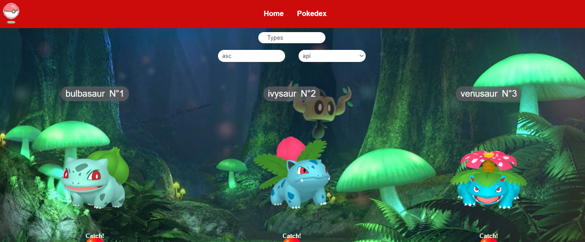

# Poke-Api-PHP
 Application made with PHP that searches the use and consumption of Api and Database to present information on a topic.
 
 The objective of this project is to demonstrate the skills acquired for the creation of a web page from the Backend side and the use of a database, presenting dynamic information and inserting information, the use of methodology in this application is that of MVC.

