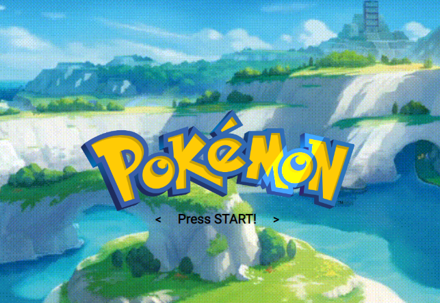

# Poke-Api-PHP
 Application made with PHP that searches the use and consumption of Api and Database to present information on a topic.
 
 The objective of this project is to demonstrate the skills acquired for the creation of a web page from the Backend side and the use of a database, presenting dynamic information and inserting information, the use of methodology in this application is that of MVC.

Acquired learning

-Present data dynamically in this case Pokemons.

-Use of MVC for pages.

-Creation of Pokemons with a database implementing their characteristics

-Modeling of a page dedicated to learning

-The use of PHP in a complex page.

-Use of and consumption of apis in PHP with Curl,
Database management.
